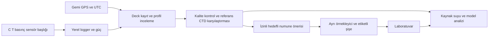

# PWN Arctic v1 mühendislik konsepti

22 Eylül 2026 — U6 durum güncellemesi. **Bu belge üretime hazır tasarım veya çalışmış Arktik cihazı değildir.** Mülakatta gösterilecek ayrı Arctic v1 CAD/BOM/operasyon konseptinin gereksinimlerini tanımlar. Yazılım/firmware izni U6 ile verildi; bu izin gerçek CAD, son sensör seçimi veya saha doğrulamasının tamamlandığı anlamına gelmez. Güncel iş durumu [BUILD_STATUS.md](BUILD_STATUS.md), ayrıntılı mühendislik paketi [Arctic v1](../hardware/pwn-arctic-v1/README.md) içindedir [E17](EVIDENCE_MAP.md).

Kanıt bağlantıları: sefer koşulları [E07](EVIDENCE_MAP.md), önceki Türk araştırma hattı [E08](EVIDENCE_MAP.md), ölçüm iddia sınırları [E13](EVIDENCE_MAP.md), mühendislik önerileri [E16](EVIDENCE_MAP.md). Korunan F/W atıfları [kaynak kaydındadır](PROJECT_SOURCE_OF_TRUTH.md).

## Görev

Araştırma gemisinden, sefer ekibinin uygun bulduğu istasyonlarda su kolonunun fiziksel profilini kaydetmek; model–gözlem farkını incelemek; uygun derinliklerden alınacak fiziksel numunelere rehberlik etmek. Ana platforma kaynak suyu karakterizasyonu sağlar. Yıllık tatlı su arzını, tarımsal su çekimini veya bütün üretim sınırını tek başına ölçmez [U1; F5 s.6; W2–W4].

## V0.1'den farkı

| Bileşen | V0.1 | Arctic v1 hedefi |
|---|---|---|
| İletkenlik | DIY/ucuz hücre, tank aralığı | Hedef deniz suyu aralığı ve soğuk koşullara uygun sensör; bilimsel hata hedefi uzmanla |
| Sıcaklık | Suya uygun PoC probu | Doğruluğu ve tepki süresi referansla sınanmış sensör |
| Derinlik | Encoder ile kontrollü tank mesafesi | Gerçek basınç, yüzey referansı ve uygun derinlik dönüşümü |
| Elektronik | Kuru tarafta masaüstü kutu | Basınç/soğuk/sızdırmazlık gereksinimleri belirlenmiş gövde veya uygun bağlantılı mimari |
| Taşıma | Elle tank inişi | Gemiye uyumlu taşıyıcı çerçeve, ayrı yük halatı ve geri alma bağlantısı |
| Referans | EC metre/termometre bulunabilirse | Profesyonel/reference CTD karşılaştırması ve kalibrasyon kaydı |
| Numune | Deney noktaları | Ayrı, uygun örnekleyiciyle kayıtlı deniz numunesi |
| Konum | Tank/deney kimliği | Gemi veya deck GPS + UTC; sualtı GPS varsayımı yok |

Hedef tasarım kullanıcının kapsamıdır; sayısal çalışma derinliği, pil süresi ve hata toleransı henüz belli değildir [U1].

Arctic v1, v0.1'in etiketi değiştirilmiş sürümü olmayacak. V0.1 tankta prensibi gösterir; deniz koşullarındaki ölçüm niteliği ayrıca referansla sınanır [E13, E16](EVIDENCE_MAP.md).

## Konsept blokları

Önerilen varsayılan operasyon: önce profil, geri alma ve çevrimdışı analiz; ardından sefer koşulları izin verirse hedefli örnekleme. Canlı kablolu veri varsa tek geçişe uyarlanabilir. İki geçiş arasında akıntı ve gemi konumu değişirse numune ilk profille birebir aynı suyu temsil ediyor sayılmaz; zaman/konum/derinlik farkı kaydedilir [F1:1417–1425; Öneri].

## CAD'de gösterilecek parçalar

1. Taşıyıcı çerçeve ve üst yük alma noktası; sensör konnektörlerinden ayrı mekanik yük yolu.
2. Akışa açık C/T sensörleri ve koruyucu kafes; sensörleri gereksiz kapalı hazneye sıkıştırmayan yerleşim.
3. Basınç sensörü/portu; gövde içindeki hava basıncını deniz basıncı diye ölçmeyecek yapı.
4. Logger, enerji ve sızdırmaz bağlantıların konsept hacmi.
5. Ağırlık/denge ve kablo strain-relief yerleri; güvenli geri alma bağlantısı.
6. Gemi/deck ünitesi ve numune alma akışını gösteren ikinci çizim.

Boyut, malzeme, conta ve kalınlıklar uzman görüşü ve test olmadan “basınca dayanır” diye işaretlenmeyecek. Mülakat CAD'i parça ilişkilerini gösterecek; imalat onayı değil [U1; Öneri].

## Sensör gereksinimi nasıl belirlenecek?

Önce araştırmacılarla anlamlı en küçük T/S değişimi ve hedef düşey yapı konuşulacak; sonra sensör aralığı, doğruluk, tekrarlanabilirlik, tepki süresi ve drift seçilecek. Sensörün katalog çözünürlüğü cihaz doğruluğu sayılmayacak. C/T/p için ortak örnekleme zamanı ve prob hareketi dikkate alınacak [U1; W18–W19; Öneri].

Turbidity yalnız yardımcı bilgi sağlıyorsa eklenecek; partikül sinyali buzul kökenini tek başına kanıtlamaz. pH/DO/klorofil varsayılan çekirdeğe alınmadı [U1].

## Fiziksel numuneler

İki ayrı bilimsel amaç korunacak:

- **Kaynak izleme:** δ18O, δ2H ve gerekirse uygun yardımcı ölçümler. Kaynak uç bileşenleri ve karışım varsayımları olmadan her su kökeni kesin ayrıştırılmaz [W20].
- **Üretim/arıtma kullanılabilirliği:** EC/tuzluluk, Na, Cl, Ca, Mg, bor, alkalinite gibi adaylar; üretim yöntemi ve arıtma sorusuna göre seçilir [U1; W6].

Aynı şişenin her analiz için uygun olacağı varsayılmaz. Hacim, kap, koruma, depolama sıcaklığı, taşıma ve deniz suyu matrisi kabulü laboratuvarın analize özgü protokolüyle kesinleşir. Bu aşamada tam panel veya kimyasal koruma tarifi verilmez [Öneri].

İstasyon başına olası örnekler yüzey, belirgin geçiş ve arka plan derinlikleri olabilir; bunlar kesin sayılar değildir. Adaptif yöntemin yararı sınanacaksa aynı toplam numune sayısıyla sabit derinlik seçimine karşılaştırılır [F1:4319–4354; düzeltilmiş yöntem önerisi].

Kaynak izleme [E10](EVIDENCE_MAP.md), arıtma/üretim bağlantısı [E06](EVIDENCE_MAP.md), adaptif örnekleme öncülleri ve kendi deney önerimiz [E11, E16](EVIDENCE_MAP.md) ile izlenir. İzotop paneli, şişe sayısı, derinlikler ve laboratuvar erişimi kesinleşmiş değildir.

## Sefer operasyonu

1. Sefer ekibi istasyon ve indirmenin uygunluğunu belirler.
2. Cihaz kimliği, kalibrasyon, güç, hafıza, UTC/GPS ve yüzey basıncı kontrol edilir.
3. İzinli derinlikte profil alınır; iniş/çıkış, gemi hareketi ve operasyon notları kaydedilir.
4. Cihaz geri alınınca veri iki kopya saklanır ve kalite kontrol yapılır.
5. Referans CTD varsa eşleştirilir; hedefli örnek için seferin izin verdiği yöntem uygulanır.
6. Numune zinciri ve dosya ilişkisi tamamlanır; anomali yorumu laboratuvar ve bağlamla değerlendirilir [Öneri; F5 s.3,5–6].

Sabit rota, her istasyonda çalışma, gemi CTD'sine erişim, internet veya elektrik garantisi yoktur. Kendi enerji/kayıt düzeni ve sahada basit bakım yaklaşımı çağrıya uygun tasarım gerekçesidir [F5 madde16,18,19].

## Uzman görüşü için kısa gündem

- Önceki tabakalaşma çalışmalarına göre sensörlerin gerçekten ayırt etmesi gereken fark nedir?
- Uygun reference CTD ve eşzamanlı karşılaştırma nasıl yapılabilir?
- Hangi fiziksel örnek hangi araştırma sorusunu cevaplar; deniz suyu için hangi laboratuvar?
- Gemi için hangi boyut/ağırlık/halat/bağlantı ve operasyon süresi gerçekçidir?
- PWN gözlemleri, hangi model ürünü ve hangi kaynak suyu senaryosu için anlamlıdır?

İlgili geçmiş çalışmalar [TASE_ALIGNMENT.md](TASE_ALIGNMENT.md) içindedir. İsimler bilimsel ilişkiyi gösterir; danışmanlık veya ekipman sözü verilmiş değildir [U1].

## Seçilme sonrası geliştirme sırası

Sensör ve operasyon gereksinimi → referansla laboratuvar karşılaştırması → sızdırmazlık/soğuk ve uygun basınç testleri → uygun yerel deniz denemesi → sefer ekibiyle son protokol. Her adımda gerçek sonucu kaydet. Bu sıra, şimdi PoC üretmenin ön koşulu değildir; Arctic v1'e dönüşüm yoludur [Öneri].

## Arctic v1 BOM planı

Bu tablo satın alma listesi değil, mülakat konseptinin parça ve seçim planıdır. Marka/fiyat/stok, mühendislik gereksinimi netleşince doldurulur; 2027'de kullanılacağı garantili bir parça yoktur [E16–E17](EVIDENCE_MAP.md).

| Grup | Planlanan bileşen | Seçimden önce gereken bilgi |
|---|---|---|
| Fiziksel ölçüm | Conductivity hücresi ve elektronik okuma kanalı; sıcaklık sensörü | Deniz aralığı, soğuk sınırı, hedef anlamlı sinyal, tepki süresi, referansla hata |
| Derinlik | Deniz suyuna uygun basınç sensörü/portu | Çalışma derinliği, yüzey referansı, basınç ve derinlik dönüşümü |
| Kayıt/zaman | Kontrolcü, saat, yerel bellek ve aktarım arayüzü | İnternetsiz çalışma, gerçek tüketim, zaman sapması, kayıt kurtarma |
| Enerji | Uygun batarya paketi ve kuru tarafta servis/şarj düzeni | Soğukta kapasite, sefer süresi, taşıma ve gemi kuralları |
| Gövde | Logger/güç gövdesi, bağlantılar, contalar | Basınç/soğuk testi, korozyon ve bakım, sensörlerin akış görmesi |
| Mekanik | Deniz çerçevesi, taşıma/geri alma noktası, halat, ağırlık | Gemi güvertesi, izinli yük/ölçüler ve elle/vinçle operasyon |
| Konum | Gemi/deck GPS ve UTC eşleme arayüzü | Erişim, kayıt biçimi ve sensör zamanı eşleştirmesi |
| Referans | Uygun profesyonel CTD erişimi/karşılaştırma oturumu | Kurum, tarih, cihazın kalibrasyonu ve eşleştirme yöntemi |
| Numune | Uygun ayrı örnekleyici; analize özgü şişe, etiket ve taşıma | Gemi ekipmanı, laboratuvar matrisi/protokolü, numune lojistiği |
| Opsiyon | Turbidity kanalı | RQ'ya ek bilgi ve saha uygulanabilirliği; otomatik zorunlu değil |
| Saha yedeği | Uygun kablo, konnektör, bellek, enerji ve servis araçları | Gemi üzerinde gerçekten değiştirilebilir parçalar |

Mülakat konseptinde dış görünüş yanında sensör–logger–güç yerleşimi, ayrı yük yolu, numune akışı ve bu açık seçimler görünür olacak. Render bir mühendislik fikrini gösterir; sualtı testinin yerine geçmez [E16–E17](EVIDENCE_MAP.md).

## Saha bağlantısı ve arıza sınırı

Rota/istasyon fırsatları, baseline kaydı, GPS/UTC, referans eşleşmesi, fiziksel örnek ve yedek akış [ARCTIC_FIELD_PLAN.md](ARCTIC_FIELD_PLAN.md) içindedir. Arctic v1'in referans ve soğuk/deniz doğrulaması [PWN_VALIDATION_PLAN.md](PWN_VALIDATION_PLAN.md) ile izlenir.

Model–gözlem karşılaştırması yalnız eşleştirme kapsamındaki suyu değerlendirir. İlgili kıyısal senaryoda gözlenen kaynak koşulları arıtma/enerji hesabına girebilir; başka yerdeki karasal yıllık su arzını doğrudan güncellemez. Gemi rotası aday su kaynağını temsil etmiyorsa üretim bağlantısı `gözlemle beslenen senaryo` olur [E06, E18–E19](EVIDENCE_MAP.md).
