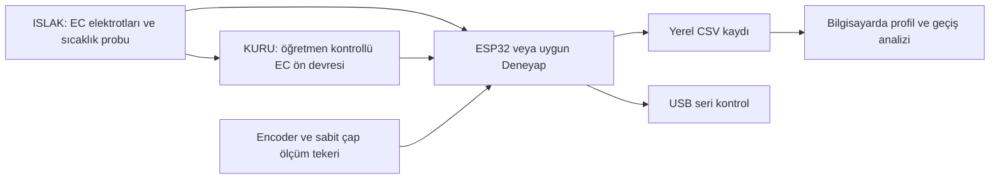

# PWN v0.1 — bilişim, elektronik ve atölye öğretmenlerine

**En güncel atölye listesi:** [PWN_V01_TAM_MALZEME_LISTESI.md](PWN_V01_TAM_MALZEME_LISTESI.md). Hazır DFR0300 K1 kitli v0.1 için elektronik, standartlar, sarf, mekanik ve okul araçları tek dosyada. 3D yazıcı mevcut (kullanıcı beyanı). Bu listede kitli yol seçildiği için aşağıdaki DIY EC ön devresi alternatif tarihsel hazırlıktır; sıfırdan elektrot/AC sürücü alışverişi yapılmayacak. Gerçek SD modülü uyumu, kart bağlantısı ve fiziksel deney tamamlanmadı.

22 Eylül 2026. **Yapım desteği için kısa teknik dosya.** Yazılım/firmware geliştirmesine kullanıcı onay verdi. Fiziksel kart, malzeme envanteri ve analog devre henüz teyit edilmedi; bu belge yapılmış cihaz raporu değildir. [Güncel durum](BUILD_STATUS.md), [onaylı kapsam](PWN_SPEC_V0.1.md).

**Türkiye'den temin için güncel ek:** [Sunum prototipi alışveriş ve yapım listesi](PWN_TURKIYE_ALISVERIS_V01.md). Hazır K1 EC kitiyle kendi logger/encoder/mekanik sistemimizi kurma önerisi içerir; alım/kurulum yapılmış değildir. Seçilen NPN encoder ve30pin kart için aşağıdaki örnek pin/besleme planı doğrudan aktarılmayacak.

## 1. PWN nedir?

Polar Water Node, su kolonunda iletkenlik sinyali, sıcaklık ve derinlik değişimini birlikte kaydetmek için geliştireceğimiz küçük ölçüm sistemidir. İlk sürümü okulda kontrollü su kolonunda çalışacak. Sonunda derinliğe karşı gerçek profil grafiği görmek istiyoruz [E13/E16](EVIDENCE_MAP.md).

## 2. Ana projedeki görevi nedir?

Ana projemiz iklim değişikliği altında su ve üretim karar desteğidir. PWN onun saha gözlem katmanıdır. İleride deniz modeliyle gerçek Arktik profilini karşılaştıracak; uygun kıyısal su kaynağı senaryosunda kaynak özelliklerinin arıtma/enerji kararına etkisini inceleyeceğiz. Deniz profili yıllık tarımsal su miktarı değildir [bilimsel mimari](SCIENTIFIC_ARCHITECTURE.md).

## 3. V0.1'de neyi kanıtlamak istiyoruz?

“Farklı iletkenlikte su tabakalarını kendi düzeneğimizle algılayıp derinliğe göre kaydedebiliyor muyuz?” Homojen su ve tabakalı kolonu karşılaştıracağız; birkaç tekrarı aynı grafikte göstereceğiz. Bu küçük ama gerçek bir fiziksel kanıt olacak [doğrulama planı](PWN_VALIDATION_PLAN.md).

## 4. Ne iddia etmiyoruz?

Araştırma sınıfı CTD, mutlak deniz tuzluluğu doğruluğu, Arktik soğuk/basınç dayanımı veya suyun buzuldan geldiği sonucu yok. Bağımsız referans yoksa doğruluk yüzdesi/santimetre hata yazmıyoruz. Sensörün verdiği ham sayıyı EC veya salinity diye adlandırmıyoruz [E13](EVIDENCE_MAP.md).

## 5. Blok diyagram

İp başlığı taşır; sinyal kablosu taşımaz. Güç, kart ve ön devre kuru tarafta kalır. Bu şema mühendislik önerisidir [E16](EVIDENCE_MAP.md).

## 6. Sensör/elektronik mimarisi

Bir kontrolcü, bir sıcaklık probu, encoder, EC hücresi + analog ön devre ve yerel kayıt yeterli çekirdektir. Somut pin örneği **ESP32-DevKitC V4/WROOM-32E** için hazırlanmıştır; okulda bu kartın olduğu varsayılmıyor. Deneyap veya başka ESP32 için pinler yeniden eşleştirilecek. [WIRING.md](../hardware/pwn-v0.1/WIRING.md).

## 7. İletkenlik ölçüm fikri

İki aynı malzemeli elektrot sabit tutucuda duracak. Öğretmen, uygun AC/dengeli kutuplama, akım sınırlama ve ADC'ye uygun çıktı sağlayan ön devreyi seçecek. **Bu devre henüz hazır şema değildir; elektrotlar doğrudan GPIO/ADC'ye bağlanmayacak.** Okulda uygun aralıklı hazır EC modülü varsa önce onunla prensip gösterimi yapılabilir. [CONDUCTIVITY_CELL.md](../hardware/pwn-v0.1/CONDUCTIVITY_CELL.md).

## 8. Sıcaklık ölçümü

Suya uygun paketli DS18B20 bir PoC adayıdır. Üç telli harici besleme; örnek pin planında DQ27 ve başlangıçta 4,7 kΩ pull-up kullanılır. Prob kablosunun renkleri standart sayılmaz. Çip veri sayfası, satılan metal probun sızdırmazlık/deniz dayanımı belgesi değildir. [Üretici veri sayfası](https://www.analog.com/media/en/technical-documentation/data-sheets/DS18B20.pdf).

## 9. Encoder ile tank derinliği

İp, sabit çaplı ölçüm tekerinden kaymadan geçer; encoder teker dönüşünü sayar. Cetvelle bilinen mesafelerde counts_per_meter kalibre edilir. Aşağı yön pozitif; yüzey sıfırı EC ölçüm merkezine göre tanımlanır. Çok kat sarılan makaranın çapı değişeceğinden mesafeyi ondan hesaplamıyoruz. Denizde kablo uzunluğu dikey derinlik yerine kullanılamaz. [Mekanik tarif](../hardware/pwn-v0.1/MECHANICAL_BRIEF.md).

## 10. Yerel kayıt

microSD veya kartta uygun yerel bellek. Dosyada cihaz/deney/cast kimliği, zaman ya da geçen süre, ham EC sinyali, sıcaklık, encoder ve kalite notu bulunur. Ham birim ayrı metadata'da yazılır. Tankta GPS/basınç alanları boş kalır. Kayıt durdurulup yeniden açılabilmeli. USB kaydı geçici yedektir; bağımsız logger'ın tamamlandığı anlamına gelmez. [DATA_SCHEMA.md](../hardware/pwn-v0.1/DATA_SCHEMA.md).

## 11. Mekanik yerleşim

Açık prob kafesi, ayrı taşıma ipi, kablo strain relief, gerekirse denge ağırlığı; sensörler yakın ama birbirini kapatmayan konumda. Kart/ön devre/SD kuru kutuda. Boyut gerçek prob ve kolon ölçülerinden çıkarılır. [CAD_BRIEF.md](../hardware/pwn-v0.1/CAD_BRIEF.md).

## 12. Şeffaf deney kolonu

Başlığın rahat hareket ettiği mevcut şeffaf kap/kolon, sağlam stand, dış cetvel ve dökülme tepsisi kullanılır. Yaklaşık bir metre sınıfındaki kolon fikir verebilir ama zorunlu ölçü değildir. Tabakalı deneyde benzer sıcaklıktaki yoğun çözelti alta, seyreltilmiş çözelti üste yavaş eklenir. Her iniş tabakayı bozabileceği için yeniden hazırlama not edilir [E16](EVIDENCE_MAP.md).

## 13. Yapılacak kontrollü deneyler

| Deney | Beklenen öğrenme |
|---|---|
| Homojen su | Olmayan tabakaya alarm veriyor mu? |
| Güçlü iletkenlik farkı | Belirgin geçişi görüyor mu? |
| Zayıf fark | Fark küçülünce sinyal ne oluyor? |
| Aynı ana çözelti, farklı sıcaklık | Sıcaklık etkisini yanlış yorumluyor mu? |
| Tekrar profilleri | Sonuç ne kadar tekrarlanıyor? |

Önce homojen + güçlü tabaka ve gerçek dosya; ardından zayıf/sıcaklık kontrolü. Başlangıçta üç tekrar pratik öneridir. Ayrıntı [TEST_PROCEDURE.md](../hardware/pwn-v0.1/TEST_PROCEDURE.md).

## 14. Kalibrasyon/referans ihtiyacı

Ödünç EC metre ve deney aralığına uygun standartlar çok yararlı; referans termometre, terazi/ölçülü kap ve cetvel de istenir. Kalibrasyon noktası ile bağımsız test noktası ayrı tutulur. EC metre bulunamazsa bağıl sinyalle çalışılır. Tabaka sınırına ait bağımsız derinlik/EC referansı yoksa “sınırı şu hata ile bulduk” denmez [PWN_VALIDATION_PLAN.md](PWN_VALIDATION_PLAN.md).

## 15. En küçük başarı ölçütü

Gerçek C/T/mesafe kaydı açılabiliyor; homojen ve güçlü tabaka grafikleri farklı davranışı gösteriyor; tekrarlar ve kayıt sorunları görünür. Eksik kanal varsa tamamlanmadığı yazılır. Başarıya peşinen ±cm/PSU hedefi koymuyoruz. Çalışan düzenek ve dürüst grafik mülakat için ana çıktı [E16/E17](EVIDENCE_MAP.md).

## 16. Su ve elektroniğin ayrılması

Düşük gerilimli kuru ünite; ıslak alanda yalnız uygun problar. Bağlantı değişikliği enerjisiz yapılır. Kart girişine 5 V/negatif sinyal verilmez. DevKitC tek güç yoluyla beslenir; USB ile harici header beslemesi birlikte kullanılmaz. Kolon sabitlenir; taşıma yükü kabloya verilmez. [Üretici güç uyarısı](https://docs.espressif.com/projects/esp-dev-kits/en/latest/esp32/esp32-devkitc/user_guide.html#power-supply-options).

## 17. Öğretmenden istediğimiz yardım

**Elektronik:** EC hücresi/ön devre seçimi, besleme-giriş kontrolü, şema ve ilk kararlı sinyal. **Bilişim:** kart/firmware ayarı, logger, sensör zamanlaması, CSV kontrolü. **Atölye:** prob tutucu, ip/teker, sağlam kolon ve kuru kutu. Öğrenciler çözelti, kayıt, tekrar, grafik ve anlatımı sahiplenir. Yardım alınan iş açık belirtilir.

## 18. Okulda bulunabilecekler

ESP32/Deneyap, encoder, DS18B20, SD modülü, kablo/direnç/breadboard, multimetre, osiloskop, lehim, powerbank, şeffaf kap, cetvel, terazi ve 3D yazıcı. **Vardır demiyoruz:** öğretmen bu listeyi envanterle işaretleyecek. [BOM.csv](../hardware/pwn-v0.1/BOM.csv).

## 19. Yalnız yoksa alınacaklar

Eksik çekirdek kart/sıcaklık/encoder/kayıt parçası, seçilmiş EC devre malzemesi, uygun elektrot ve mekanik sarf. Ön devre seçilmeden rastgele modül alınmaz. Referans cihazı önce ödünç ararız. Pahalı deniz EC, pressure sensor, pH, DO ve turbidity ilk PoC'nin satın alma şartı değil. Fiyat ve stok uydurulmadı.

## 20. Yedek yollar

| Sorun | Devam |
|---|---|
| DIY EC çalışmıyor | Uygun aralıklı mevcut/ödünç modül; yoksa EC sonucu iddiası yok |
| Encoder yok/kayıyor | Cetvelle işaretli sabit konum; `manuel derinlik`, entegrasyon eksik |
| Sıcaklık probu yok | Dış termometreyle kontrollü sıcaklık; sıcaklık kanalı eksik |
| SD bozuk | USB bilgisayar kaydı; bağımsız logger eksik |
| Canlı demo aksıyor | Kendi önceki gerçek video/ham kayıt; yoksa konsept |

Hiçbir yedek eksik işi yapılmış saymaz. [Ayrıntılı fallback](PWN_SPEC_V0.1.md).

## 21. V0.1 ve Arctic v1

V0.1: tank, bağıl/kalibre edilmişse EC, sıcaklık, encoder, kuru elektronik. Arctic v1: hedefe uygun cold-rated C/T, gerçek basınç, profesyonel CTD karşılaştırması, marine frame/tether, uygun yerel kayıt/güç ve numune akışı. Derinlik/accuracy/dayanım/analiz paneli uzmanla seçilecek. [Arctic paket](../hardware/pwn-arctic-v1/README.md).

## 22. Dokuz günlük uygulama takvimi

| Tarih | Öncelik |
|---|---|
| 22 Eylül | Bu paketi öğretmenle incele; envanter, kart ve EC yolunu seç |
| 23 Eylül | Kuru sıcaklık/encoder/logger; analog ön devre paralel |
| 24 Eylül | Gerçek ham sinyal; cetvelle mesafe; CSV açma |
| 25 Eylül | Homojen + güçlü kolon, tekrarlar |
| 26 Eylül | Sorun düzeltme; mümkünse zayıf/sıcaklık kontrolü |
| 27 Eylül | Gerçek video/grafik yedeği; mektupların iç teslimi |
| 28 Eylül | Formun teyit edilen saate göre teslimi; yeni özellik durur |
| 29 Eylül | Taşıma/güç/çevrimdışı prova |
| 30 Eylül | Mülakat |

Takvim hedef, mevcut cihazın hazır olduğunu söylemez; 48 saatlik form kuralının tam saati teyit edilir [E15](EVIDENCE_MAP.md). İlk kurulum için gereken net iş: **kuru kayıt devresi + öğretmen seçimi EC ön devresi + sabit geometrili prob + ip/encoder/kolon mekaniği.**
