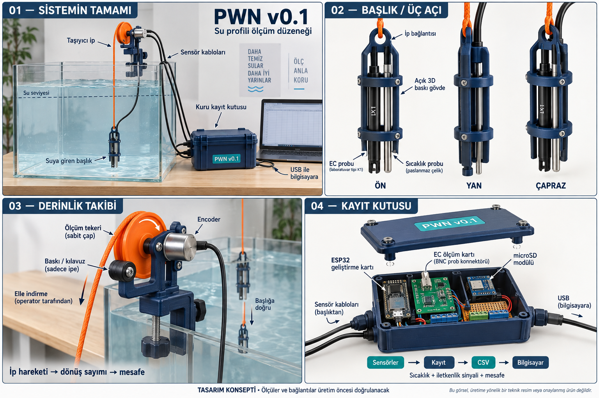

# PWN v0.1 — ortaya çıkaracağımız cihaz

## Çok açılı konsept görseli

22 Eylül 2026'da Imagegen ile üretilmiş açıklayıcı tasarım görselidir. Fiziksel cihaz fotoğrafı, ölçülü CAD, gerçek kart bağlantı şeması veya üretilmiş parça değildir. Dört panel: sistemin tamamı; başlığın ön/yan/çapraz görünüşü; encoderlı sabit çaplı ölçüm tekeri; açık kuru kayıt kutusu ve veri akışı. Turuncu ip ayrı yük yoludur; siyah sensör kabloları yük taşımaz. Braketin gösterilen kaba bağlantısı gerçek yük/boyut kontrolünün yerine geçmez. Görsel üretim sonrası incelendi ve proje içine kaydedildi; teknik imalat doğrulaması yapılmadı.

22 Eylül 2026. Kullanıcı önceliği: önce fiziksel cihazı ortaya çıkarmak; ayrıntılı deney tasarımına daha sonra dönmek. Mevcut sensör/elektronik yönü korunuyor. Aşağıdaki tarif tasarım hedefidir; üretilmiş cihaz veya tamamlanmış CAD değildir.

## Tek cümle

PWN v0.1, suya elle indirilen sensör başlığı ile yukarıda kalan derinlik takip ve kayıt ünitesinden oluşan, kablolu bir su profili ölçüm düzeneğidir.

## 1. Suya giren başlık

3D basılmış, açık yapılı bir taşıyıcı içinde DFR0300 K1 iletkenlik probu ve DS18B20 sıcaklık probu tutulacak. Alt ölçüm bölgesine su serbestçe ulaşacak. Üstte taşıyıcı ip için bağlantı ve kabloları düzenleyen tutucular olacak. Gerekiyorsa denge ağırlığı, ölçümü etkilemeyecek uzaklığa konacak.

Görünüş hedefi: tek parça gibi taşınabilen, kabloları toparlanmış küçük dikey sensör başlığı. Ölçüm uçları korunaklı fakat açıkta kalacak; sensörlerin etrafı kapalı plastikle sarılmayacak. Kesin çap/boy, gerçek problar ölçülerek belirlenecek. Başlığa ESP32, batarya veya SD konmayacak.

## 2. Yukarıda duran derinlik takip mekanizması

Stand/kenara sabitlenen bir braket üzerinde encoder, sabit çaplı ölçüm tekeri ve ip baskı/kılavuzu bulunacak. Başlığı taşıyan ip teker üzerinden geçecek. Kullanıcı ipi elle kontrollü bırakıp çekecek; tekerin dönüşü encoder tarafından sayılacak. Sensör kabloları rahatça hareket edecek, yük taşımayacak ve ölçüm tekerine sarılmayacak.

İp çok katlı sarılan bir makaradan açılıyorsa bile mesafe onun değişen çapından hesaplanmayacak. Ayrı sabit çaplı teker mesafeyi izleyecek. Kontrollü düşey kullanımda yüzey sıfırı ve prob ölçüm merkezi tanımıyla derinlik tahmini üretilecek; denizde gerçek basınç ölçümünün yerine geçtiği söylenmeyecek.

## 3. Kuru kayıt kutusu

Suyun dışında duran kutuda ESP32, EC kitinin ölçüm kartı, giriş uyarlama devresi, microSD modülü ve sağlam bağlantılar bulunacak. EC ve sıcaklık kabloları ile encoder bağlantısı buraya gelecek. USB üzerinden tek güç yoluyla beslenecek; bilgisayarla veri bağlantısı kurulabilecek. Gösterim için çıplak breadboard yerine sabitlenmiş, kapaklı ve soketleri etiketli montaj hedefleniyor.

EC ham sinyali, sıcaklık, encoder sayımı ve geçen süre eşleştirilip microSD'ye kaydedilecek. Bu kayıt işi için firmware entegrasyonu henüz tamamlanmadı. Kart seçimi, EC gerilim uyarlaması ve SD sinyal seviyeleri tam malzeme dosyasındaki şartlara göre kurulacak.

## 4. Bilgisayardaki karşılığı

Kaydedilen gerçek CSV ve metadata, mevcut uygulamanın PWN içe alma bölümüne aktarılacak. Böylece başlığın aşağı hareketi boyunca alınan sinyal/sıcaklık profili görülebilecek. İlk tamamlanma hedefi yerel kayıt ve dosya aktarımıdır. Canlı grafik daha sonra bağlanabilir; mevcut uygulamada cihazdan canlı akış çalışıyor denmez.

## Atölyeye söylenecek kısa tarif

“İki su probunu açık bir 3D baskı başlıkta birleştiriyoruz. Başlık ayrı bir iple taşınacak. Yukarıda ip hareketini ölçen encoderlı teker olacak. Kartlar ve SD kuru bir kutuda kalacak. İletkenlik sinyali, sıcaklık ve mesafeyi aynı kayıt sisteminde toplayacağız. Önce bu üç fiziksel parçayı çalışır bir bütün olarak ortaya çıkaracağız.”

## Yapım sırası ve fiziksel teslim

1. Gerçek EC kiti, sıcaklık probu, encoder ve kartları temin edip boyutlarını ölçmek.
2. Sensör başlığı, encoder braketi/teker/kılavuz ve kutu montajını CAD'de hazırlayıp basmak. Kullanıcı 3D yazıcı erişimini doğruladı.
3. Probları başlığa, encoderı brakete, elektroniği kuru kutuya monte etmek; ayrı ip yük yolunu ve kablo hareketini kurmak.
4. Sıcaklık, encoder ve EC okuma/kayıt firmware'ini bağlamak; gerilim ve yerel dosya kontrollerini yapmak.
5. Suya kısa daldırmada sensör yanıtı ve başlık hareketiyle dosya oluştuğunu kontrol etmek. Bu, cihazın çalışır kabulü için işlev kontrolüdür; ayrıntılı tabakalı deney kampanyası ayrı iştir.

Fiziksel teslim: elde tutulabilir sensör başlığı + standa bağlanan mesafe mekanizması + kapalı kuru kayıt kutusu + açılabilen gerçek kayıt dosyası. Daha sonra aynı cihazla bilimsel gösterim/deney yapılacak. Motorlu araç, serbest yüzen robot, profesyonel CTD veya denize hazır basınç kabı geliştirdiğimiz iddiası yok.

## Kaynak ve durum

Bu belge önceki proje tasarımının sadeleştirilmiş cihaz tarifidir; yeni dış araştırma yapılmadı. Bileşen dayanakları ve miktarlar: [tam malzeme listesi](PWN_V01_TAM_MALZEME_LISTESI.md). Üretici belgeleri: [DFRobot EC teknik özellikleri](https://wiki.dfrobot.com/dfr0300/), [kurulum/kalibrasyon](https://wiki.dfrobot.com/dfr0300/docs/20349). Veri akışı: [yerel CSV sözleşmesi](../hardware/pwn-v0.1/DATA_SCHEMA.md).

Bu tur dokümantasyon yapıldı; parça siparişi, CAD, baskı, firmware derlemesi veya fiziksel montaj gerçekleştirilmedi. Uygulama kodu değişmedi ve testler yeniden çalıştırılmadı.
