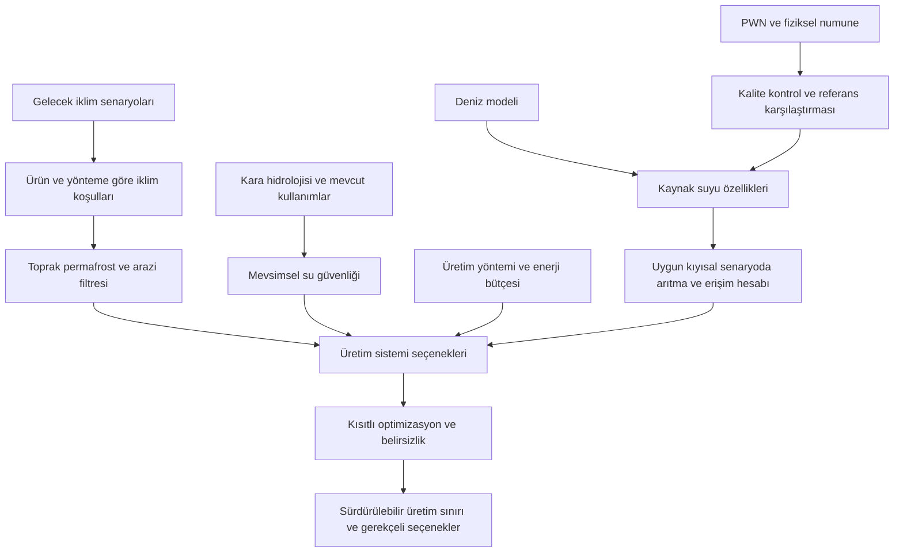

# Güncel rebuild kaydı · 22 Eylül 2026

Yeni akış north_resolution → mevcut planning.simulate → kaynak/kanıt kaydı; saha güncellemesi aynı simulate motorunu korur. Kaynak filtresi olumsuz adayları eler, olumlu tarama yerel agronomi onayı olmaz. Tek araştırma çizgisi ve fiziksel su/kullanılabilir su ayrımı REBUILD_CONTRACT içinde bağlayıcıdır.

Bağlayıcı sözleşme: [REBUILD_CONTRACT.md](REBUILD_CONTRACT.md). Çalışan/eksik ayrımı: [REBUILD_EVIDENCE_AUDIT.md](REBUILD_EVIDENCE_AUDIT.md), [BUILD_STATUS.md](BUILD_STATUS.md).

---

## Önceki ayrıntılı kayıt (tarihsel uygulama durumları kendi tarihleriyle okunur)

# Bilimsel ve teknik mimari

**22 Eylül 2026 / U9 güncel ek:** Etkileşim artık kalıcı Scenario Lab + sağ desen/veri/grafik alanıdır. [SIMULATOR_UX](SIMULATOR_UX.md). NASA SSP245/5852035 kaynak bağlamı eklendi; yerel hidroloji/uygunluk yerine geçmez. [Güncel durum](BUILD_STATUS.md), [su güvenliği](NORTH_WATER_SECURITY.md). Önceki aşama anlatıları bu güncel kayıtla birlikte okunur.
22 Eylül 2026 · U8 çekirdek motor düzeltmesi. FINAL MASTER SYNC bilimsel kapsamı korunur. Ana çalışan hesap artık [ortak ürün deseni motorudur](CROP_PATTERN_ENGINE.md); tek marul/yöntem karşılaştırması bütün ürünün modeli değildir. Güncel uygulama durumu [BUILD_STATUS.md](BUILD_STATUS.md), tarihsel dar hesap yöntemleri [MODEL_METHODS.md](MODEL_METHODS.md) içindedir. Fiziksel PWN/saha deneyi yapılmadı. F/W kodları [ana belgede](PROJECT_SOURCE_OF_TRUTH.md), E kodları [kanıt haritasında](EVIDENCE_MAP.md) bulunur.

## Çalışan çekirdek: aynı motor, iki planlama modu

**Bölge → mevcut ürün deseni veya aday portföy → kullanıcı senaryosu → su hesabı → ürün alanı/kapasite optimizasyonu → gerekçeli önerilen desen.** Türkiye'de beş ilin 21 gerçek ürün kaydı başlangıcı sağlar. Kuzeyde arpa, patates ve marul aday portföyü açık tarla/sera/hidroponik kapasitesi ve su kaynaklarıyla aynı sözleşmeye girer. Resmî kayıt, kullanıcı değişikliği ve model çıktısı ayrıdır.

Bugün uygulanan yol ETc=Kc×ET₀, yağış/depo sonrası net gereksinim ve randımanla brüt su hesabıdır. Kuzey gelecek ET₀'sı eksik olduğu için tarla suyu açık kullanıcı senaryosudur. Motor ürün bazında hedef karşılama oranını yükseltir, aynı başarıda suyu ve enerji verisi tam ise enerjiyi azaltır. Ha ve kontrollü üretim m²'si ayrı kapasitelerdir. [Kısıt sözleşmesi](PATTERN_CONSTRAINTS.md)

PWN güncellemesi aynı üretim hedeflerini ve aynı kısıtları koruyarak bu çok ürünlü motoru iki kez çalıştırır. Geçerli eşleşmede bugün değişebilen değişken kaynak sıcaklığıdır; deniz gözlemi yıllık kara suyuna dönüştürülmez. [Saha → desen](FIELD_TO_PATTERN_UPDATE.md). Aşağıdaki geniş mimari; risk, dinamik depolama, bağımsız kalibrasyon gibi henüz uygulanmayan araştırma katmanlarını da içerir.

## Ana soru ve üç somut gösterim

**Ana soru:** İklimsel olarak mümkün hale gelen üretimin ne kadarı, su ve enerji koşulları eklendiğinde gerçekten uygulanabilir kalıyor; hangi ürün–yöntem–kaynak–dönem bileşimi daha iyi sonuç veriyor? [U1; W1]

Önerilen üç kanıt halkası:

1. **Türkiye:** Aynı yeni yöntem, farklı birkaç üretim bölgesinde işe yarıyor mu?
2. **Kuzey senaryosu:** Yalnız iklim filtresinin uygun bulduğu seçenekler, su/enerji ve yöntem bilgisi eklenince nasıl değişiyor?
3. **Arktik saha:** Kaynak suyunun gözlenen durumu ile model arasındaki fark, ilgili su/arıtma alt modelini ve seçenek karşılaştırmasını nasıl etkiliyor?

İlk ikisi platformun üretim hedefini; üçüncüsü sefere gitmenin bilgi değerini gösterir. Üçüncü halkayı bütün karasal üretim haritasının doğrulaması olarak sunmayız [U1; W4; mimari çıkarım].

## Birbirine bağlanan katmanlar

Şemadaki oklar tasarlanacak hesap ilişkileridir. Deniz profili → kara akışı diye bir ok yoktur. PWN'nin arıtma bağlantısı, ancak incelenen su kaynağı ve üretim senaryosu açık tanımlanırsa kullanılır [Öneri; U1; W6].

| Katman | Girdi | Hesap/çıktı | İlk sürümde sınır |
|---|---|---|---|
| İklim | Günlük Tmin/Tmax, yağış; senaryo ve model kimliği | GDD, don olmayan dönem, ürün koşulları | Uygunluk verim tahmini değildir [W1, W7] |
| Toprak/permafrost | Toprak profili, aktif tabaka, arazi | Yönteme özgü uygunsuzluk/ek maliyet | Sera ve açık tarlaya aynı filtre uygulanmaz [W10–W11; Öneri] |
| Su güvenliği | Akış, yağış, depolama, kullanım, ET | Dönemsel arz-talep, açık, güvenilirlik | Yağış ve ondan oluşan akış iki kez arz sayılmaz [W5; Öneri] |
| Kaynak kullanılabilirliği | Su kalitesi, kapasite, erişim, arıtma | Kullanılabilir miktar, kalite ve enerji | EC tek başına tam uygunluk değildir [W6] |
| Yöntem | Açık tarla/sera/hidroponik parametreleri | Ürün, su, enerji ve alan gereksinimi | Her yöntem aynı ürünü aynı çıktıyla üretemeyebilir [U1; Öneri] |
| Enerji/kaynak | Isı/elektrik arzı, dönemsel kapasite, arıtma/pompaj/aydınlatma, çevresel bütçeler | Her seçeneğin kaynak kısıtını sağlayıp sağlamadığı | Kurulu yenilenebilir güç sürekli enerji garantisi değildir; eksik enerji verisi sıfır sayılmaz [U5; E04–E06] |
| Optimizasyon | Seçenekler, bütçeler, çıktı alt sınırı | Uygulanabilir planlar ve ödünleşimler | Her koşulda plan bulmak zorunda değil [Öneri] |
| AI | Kalite kontrollü girdiler, bağımsız test | Faydalıysa düzeltme/örnekleme/açıklama | Klasik yöntemden üstünlük varsayılmaz [U1] |
| PWN | C/T/p profili, metadata, örnekler | Kaynak suyu gözlemi ve model farkı | Su çekim hacmi veya yıllık arz ölçmez [U1; W4] |

## PWN ile üretim arasındaki somut bağlantı

Dokuz katmanın sırası: **iklim → toprak/permafrost → su güvenliği → kaynak kullanılabilirliği → üretim yöntemi → enerji/kaynak kısıtları → optimizasyon → AI/belirsizlik → PWN saha gözlemi**. Bu, dokuz bağımsız uygulama değildir; PWN ve AI ilgili hesaplara geri besleme yapar. Arayüz, her katmanın hangi seçeneği neden değiştirdiğini gösterecek [U5 §9,30; Öneri].

**Bağlantı A — model güvenilirliği:** Gözlem → sensör kalite kontrolü → aynı zaman/konum/derinlikte model değerlendirmesi → bağımsız profillerle sınanan düzeltme/belirsizlik → yalnız fiziksel olarak bağlı su sistemi alt modelinin güncellenmesi. Bu yol otomatik olarak yağış, karasal akış veya yıllık su arzı tahmini düzeltmez.

**Bağlantı B — kullanılabilir kaynak suyu:** Gözlem/numune → kaynak T/S/kimya aralığı → teknolojiye özgü arıtma ve koşullandırma → ürün suyu kalite/miktarı ve enerji → üretim seçeneklerinin karşılaştırılması. Numune paneli ve arıtma katsayısı kesinleşmedi; aşağıdaki kıyısal örnek bu yolun tasarımıdır [U5 §14; E06,E13].

**Çalışan kullanım örneği:** Kuzeyde arpa/patates açık tarla ve marul kontrollü üretim portföyünde tatlı, depolanmış ve arıtılmış su tahsisini birlikte çözmek. Eski tek kontrollü ürün örneği bu zincirin dar bir alt durumu olarak kalır.

1. Modelin verdiği besleme suyu tuzluluk/sıcaklık aralığıyla arıtma ve enerji gereksinimi hesaplanır.
2. PWN ve uygun laboratuvar analizleri kaynak suyu bilgisini günceller; önce sensör ve model farkı ayrıştırılır.
3. Aynı arıtma teknolojisi, kapasite ve üretim hedefi korunarak ikinci hesap yapılır.
4. Ürün/yöntem/kaynak deseni, enerji ve uygulanabilirlik farkı gösterilir. Güven düzeyinin değişmesi ayrıca bağımsız veriyle sınanacak araştırma işidir; uygulama tek gözlemden güven puanı üretmez.

Bu örnekte fiziksel olarak ölçülecek şey **besleme suyunun durumu**, karar ise **o kaynağa dayanan üretim seçeneğinin koşullu uygulanabilirliği**dir. TASE ölçüm noktası varsayımsal su alma noktasını temsil etmiyorsa sonuç coğrafi saha doğrulaması değil, ölçümle beslenen senaryo/duyarlılık gösterimi olarak etiketlenir [U1; F1:6150–6164,7497–7534; W6; Öneri].

Karar değişmesi başarı şartı değildir. Gözlemler aynı seçeneği daha güvenilir biçimde destekleyebilir veya beklenen katkıyı göstermeyebilir. Bu ayrım anlatıyı zayıflatmaz; neyi öğrenmek için sefere gidildiğini netleştirir [Öneri].

## Küçük fakat fiziksel anlamı olan model

Aşağıdakiler ilk uygulama için önerilen hesap sözleşmeleridir; henüz belirlenmiş parametreler veya doğrulanmış model değildir.

**Karar birimi:** bölge/hücre × ürün × üretim yöntemi × su kaynağı × üretim dönemi. Alan veya kapasite miktarı karar değişkenidir. Aynı fiziksel alanı kullanan seçenekler için ortak alan; çok katlı üretimde taban alanı ile yetiştirme alanı ayrı tutulur.

**Açık tarla talebi:** FAO-56 tabanlı ETo ve gelişme dönemine göre Kc; ardından yağış, kök bölgesi suyu, stres ve uygulama verimliliğini içeren su dengesi. Eski göreli katsayılar bu hesabın yerine konulmaz [W5; F2 s.8].

**Kontrollü üretim talebi:** sisteme giren yeni su, ürünle çıkan su, buharlaşma/terleme, tahliye, temizlik ve geri dönüş ayrı izlenir. Devirdaim hacmi yeni çekilen su gibi sayılmaz. Isıtma, soğutma, aydınlatma, pompaj ve arıtma enerji hesabı ayrı bileşenlerdir [Öneri].

**Depolama dengesi:** bir sonraki dönem stoku = mevcut stok + bağımsız dış girişler + geri kazanılan su − çekim − kayıp − tahliye. Kapasite, kaynak çekim sınırı ve korunacak çevresel/yerel kullanım ayrıca uygulanır. Birimler m³/dönem olarak birleştirilir; yağış mm'den alana göre çevrilir [W5; Öneri].

**Arıtma dengesi:** kullanılabilir ürün suyu = arıtmaya giren hacim × koşula bağlı geri kazanım oranı. Enerji = besleme koşullarına bağlı arıtma + alma/iletim + üretim sistemi enerji gereksinimi. Kaliteyi sağlayamayan ürün suyu uygun arz sayılmaz. Konsantre atık ve alım etkisi çevresel değerlendirmede yer alır. Bu belge evrensel geri kazanım ya da enerji katsayısı atamaz [W6; Öneri].

**Optimizasyon:** İlk yaklaşım, üretim/beslenme alt sınırını koruyan uygulanabilir planları bulmak; su açığı ve enerji için birkaç Pareto seçeneğini göstermek. Gerekli yerde iklim riski, emisyon ve çevresel sınırlar eklenir. Ağırlıklı tek puan kullanılacaksa normalizasyon ve ağırlıklar kullanıcıya görünür olur. Sonuç `uygun`, `koşullu`, `uygun değil` veya `veri yetersiz` olabilir [U1; Öneri].

**Üretim karşılaştırması:** Buğday ile marul kilogramı doğrudan eşdeğer gıda üretimi sayılmaz. U8 motorunda ürün bazında ayrı hedefler ve açık öncelikler kullanılır. Enerji/protein gibi ortak beslenme çıktısı için veri/model ayrıca gerekir [U1'in nutrition output hedefinden çıkarım; CROP_PATTERN_ENGINE].

## Basit doğrulama planı

| Soru | Karşılaştırma | Ölçülecek şey |
|---|---|---|
| Türkiye'de aktarılıyor mu? | Bir bölgede ayarlandıktan sonra başka bölge/yılda test | Veri varsa ET/su ihtiyacı/verim hatası; kararın bütçe ve üretim hedefini karşılama durumu |
| Yeni katman karar için gerekli mi? | İklim-only → iklim+su → iklim+su+enerji/yöntem | Elenen seçenekler, su açığı, enerji, çıktı, karar hassasiyeti |
| PWN prensibi çalışıyor mu? | Homojen kolon ve tabakalı kolon; bağımsız referans noktaları | Geçişi bulma, yanlış alarm, tekrar tutarlılığı |
| PWN Arctic v1 doğru ölçüyor mu? | Referans CTD ile uygun eşleştirme | Bias, RMSE ve derinliğe göre hata |
| Gözlem model katkısı veriyor mu? | Dondurulmuş temel model vs basit düzeltme vs uygun AI | Ayrı profil/istasyonlarda hata; belirsizlik aralığı kapsaması |
| Adaptif örnekleme faydalı mı? | Eşit numune bütçesinde sabit vs gradient vs AI | Bağımsız referans karşısında kaçırılan geçiş ve profil temsil hatası |

Bunlar yeni araştırma tasarımımızdır. Dokuz günlük pakette tank testleri ve açıklanabilir karar örneği yeterli ilk adımdır; bütün tablo tamamlanmış gibi sunulmaz [U1, U3].

Bir model hücresi ile sensör noktası aynı hacmi/zaman aralığını temsil etmez. Eşleştirme zamanı, yatay uzaklık, derinlik katmanı ve ölçüm hatası kaydedilir. PWN gözlemleriyle sonradan güncellenmiş bir model, aynı gözlemlere karşı bağımsız başarı diye ölçülmez [W4, W19; Öneri].

## AI'nın görevleri ve sınırı

RQ1/H1 alan ve kısıt katkısını, RQ2/H2 bağımsız koşullardaki karar dayanıklılığını, RQ3/H3 saha bilgisinin model ve karar katkısını ayrı sınayacak. Hipotezlerin ölçütleri, başarısızlık/etkisizlik olasılıkları ve bağımsız test ayrımı [FUTURE_PRODUCTION_MODEL.md](FUTURE_PRODUCTION_MODEL.md) içinde tanımlıdır. Bunlar elde edilmiş sonuç değildir [E19].

| Görev | İlk klasik yöntem | AI adayı | Fayda ölçütü / açıklama |
|---|---|---|---|
| İklimsel uygunluk | Ürün gereksinimi, GDD/don eşikleri | Ağaç tabanlı uygunluk modeli | Ayrı bölge/yılda hata; hangi eşik/özellik belirleyici? |
| PWN anomali | Sıcaklık etkisi kontrolü + gradient + aykırı değer kontrolü | Veri yeterliyse denetimsiz veya etiketli model | Yanlış alarm ve geçiş derinliği; ham profil görünür |
| Adaptif örnekleme | Sabit derinlik / gradient önerisi | Beklenen bilgiye göre seçim | Aynı numune bütçesinde katkı; öneri insan onayında |
| Model kalibrasyonu | Düzeltmesiz model; basit bias/regresyon | Residual öğrenme | Ayrı profillerde RMSE/bias ve kapsam dışı uyarısı |
| Belirsizlik | Sensör hata bütçesi ve senaryo/model dağılımı | Kalibre tahmin aralıkları | Aralık daralması kadar gerçek değerleri kapsaması |
| Optimizasyon | Doğrusal/karma tamsayılı veya açık fiziksel model | Hesap pahalıysa surrogate | Fiziksel çözücüye göre kısıt ihlali ve karar farkı |
| Açıklama | Hesaptan üretilen şablon rapor | İsteğe bağlı LLM | Yalnız hesaplanan sonuçlar, dayanak ve belirsizliği anlatma |

Bu modüllerin tamamı ilk sürüme alınmayacak. Optimizasyonun kendisi “AI kullanıldı” iddiasıyla sunulmayacak; LLM sayısal su/enerji hesabını yapmayacak [U1; Öneri].

## Yeni uygulama için önerilen teknik yapı

**Yaklaşım:** Sıfırdan, tek repository içinde bağımsız bilimsel çekirdek ve modüler bir backend. İlk sürüm yerel bilgisayarda internet olmadan çalışabilecek; sahada bulut servisine bağımlı olmayacak [U1; F5 s.5; Öneri].

| Parça | Önerilen seçim | Amacı |
|---|---|---|
| Arayüz | React + TypeScript + Vite; MapLibre; Plotly | Bölge/senaryo, alternatifler ve dikey profilleri tek akışta göstermek |
| API | Python + FastAPI, tipli giriş/çıkışlar | Bilimsel hesapları arayüzden ayırmak [W17] |
| Bilimsel çekirdek | NumPy/pandas, xarray; gerektiğinde rasterio/GeoPandas; deniz için GSW | Zaman serisi, raster, profil ve birim dönüşümleri |
| Optimizasyon | İlk doğrusal problem için SciPy/HiGHS; gerekirse sonraki karma tamsayılı model | Önce açıklanabilir küçük problem |
| Veri | Ham dosyalar değişmez; tablosal veride Parquet, ızgarada NetCDF/COG; metadata için SQLite | Kaynak ve sürüm izlemek; hızlı yerel demo |
| Büyüme yolu | Gerektiğinde PostgreSQL/PostGIS + nesne depolama | Çok kullanıcılı ve geniş coğrafi çalışma; dokuz günlük zorunluluk değil |
| PWN aktarımı | Cihazda yerel kayıt; CSV/JSON metadata; seri bağlantıdan veya dosyadan içe alma | Gerçek ölçümü kaybetmeden görselleştirmek |
| AI | Çekirdekten ayrılmış analiz modülleri | Baseline'ı bozmadan karşılaştırmak |

Bunlar mimari adaylarıdır; U6 sonrasında ilk yazılım kesiti kuruldu. Gerçekte kullanılan paketler uygulamanın bağımlılık dosyalarında, kapsam [BUILD_STATUS.md](BUILD_STATUS.md) içindedir; bu tablonun tümü uygulanmış sayılmaz. İhtiyaç görülmeden hesap kuyruğu, mikroservis, Kubernetes veya tam MLOps kurulması önerilmiyor.

**Planlanan veri varlıkları:** region/site; crop; production_method; water_source; scenario; climate_series; water_budget; cast; observation; calibration; sample; lab_result; model_snapshot; model_run; decision_result. Her hesap sürüm ve kaynak kimlikleriyle geriye izlenebilir olacak [Öneri].

**Kullanıcı akışı:** Bölge/dönem seç → üretim hedefini gör → iklim uygunluğunu incele → su/enerji kısıtlarını aç → seçenekleri karşılaştır → PWN profilinin ilgili kaynak bilgisine katkısını gör → gerekçeli karar ve belirsizliği oku [F1:8229–8251; Öneri].

**Tasarım dili:** Türkiye'den kuzeye uzanan tek anlatı; sakin harita, okunabilir grafik, iki veya üç alternatif; ölçülmüş/model/senaryo verisi görsel olarak ayrılır. Arayüzde “sürdürülebilir” tek yeşil puanla mutlak hükme dönüştürülmez. Eksik veri sıfır gibi görünmez [Öneri].

## Gerçek açıklar ve pratik çözümü

1. **Deniz ölçümü–üretim kararı ara modeli eksik:** Bir kıyısal örnek ve açık arıtma/enerji hesabı seçelim; bütün platformu şimdiden kanıtlamaya çalışmayalım.
2. **Miktar–kalite ayrımı eksik:** PWN kalite/fiziksel durum; kullanılabilir miktar bağımsız su bütçesiyle gelecek.
3. **Yöntemlerin kıyas çıktısı eksik:** Aynı ürün veya açık beslenme hedefiyle başlayalım.
4. **Türkiye başarısı henüz yok:** Harita kapsamı ve bilimsel test kapsamını ayrı gösterelim.
5. **Ucuz ölçümün çözebileceği fark belirsiz:** İlk birkaç gün gerçek homojen/tabakalı tank deneyiyle görelim; hassasiyet iddiasını sonuçtan sonra yazalım.

Bu beş madde projeyi değiştirme gerekçesi değildir. Mevcut hikâyeyi daha somut anlatmak ve doğru parçayı önce inşa etmek için tasarım kararlarıdır [U3].
