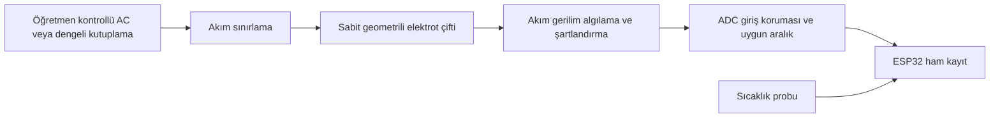

# İletkenlik hücresi: öğretmenin kuracağı ölçüm zinciri

**Hedef:** kontrollü çözeltilerde bağıl sinyal ve dikey geçiş; araştırma sınıfı mutlak tuzluluk değil. İşin açık kalan kritik parçası analog ön devredir. Bu belge bağlantı bloklarını tanımlar; doğrulanmış PCB/şema veya hücre sabiti verdiğini iddia etmez [E13/E16](../../docs/EVIDENCE_MAP.md).

## Hücre

İki aynı malzemeli elektrot; açık yüzeyleri ve araları ölçülüp kaydedilmiş sabit tutucu. Grafit veya uygun korozyona dayanıklı metal öğretmen tarafından seçilir. Sabit geometri korunur; temizleme/elektrot değişimi yeni hücre kimliği ve yeniden kontrol gerektirir. Boyutlar gerçek elektrot ve kolona göre belirlenir; burada bilimsel dayanağı olmayan milimetre verilmez.

## Ön devre için iki pratik yol

**A — hazır uygun aralıklı EC modülü:** okulda varsa ilk kayıt hızlı alınabilir. Modülün ham analog çıkışı/EC dönüşümü, sıcaklık düzeltmesi ve çıkış gerilim aralığı kendi belgesine göre kaydedilir. Düşük aralıklı TDS modülü deniz suyu ölçüm cihazı diye tanıtılmaz.

**B — DIY hücre + öğretmen tasarımlı ön devre:** net DC bileşeni azaltan uyarım, akım sınırlama, akım/gerilim algılama, ADC sinyal şartlandırma ve örnekleme zamanlaması birlikte tasarlanır. Hücreyi iki GPIO arasına doğrudan bağlayıp ADC değerini EC saymak bu tasarım değildir. Uyarım frekansı/gerilimi, dirençler ve kazanç hedef çözelti aralığıyla seçilir; ezbere devre değeri yok.

Öğretmenden istenen somut teslim: basit devre şeması, besleme, OUT sinyal aralığı/birimi, uyarım türü, ADC'nin ne zaman okunacağı ve ilk kontrol sonucu. Sonra firmware giriş sözleşmesi bu tasarıma bağlanır. Harici ADC, hatalı hücre/ön devreyi düzeltmez; ESP32 ham ADC davranışı için [üretici belgesi](https://docs.espressif.com/projects/arduino-esp32/en/latest/api/adc.html).

## Doğru ölçüm diline geçiş

- Referans yok: `raw_conductivity_signal` ve açık ADC/birim; grafik adı **bağıl iletkenlik sinyali**.
- EC standardı/metre ile eğri varsa: ham veri korunur, ayrı türetilmiş EC ve calibration_id eklenir; başka çözeltilerde kontrol yapılır.
- Sıcaklık düzeltmesi ancak kullanılan çözeltinin/modelin kapsamı belirtilerek yapılır; evrensel katsayı varsayılmaz.
- Deniz tuzluluğu dönüşümü uygun C/T/p, birim ve geçerli yöntem gerektirir. NaCl tankını otomatik okyanus salinity'sine çevirmeyiz [GSW SP_from_C](https://teos-10.org/pubs/gsw/html/gsw_SP_from_C.html).

## İlk kontrol

Önce bilinen direnç/yüklerle ön devre çıktısının doyma ve kutuplama davranışı öğretmence kontrol edilir; bunlar su kalibrasyonu değildir. Sonra benzer sıcaklıkta farklı çözeltilerde artış/azalış yönü ve tekrarlanabilirlik kaydedilir. İki çözeltiyi ayırt edemeyen sistemle tabaka deneyi başarısı vaat edilmez. Çalışmıyorsa uygun modüle geçilir; öğretmen devresi beklenirken sıcaklık/encoder/logger işleri sürer.
